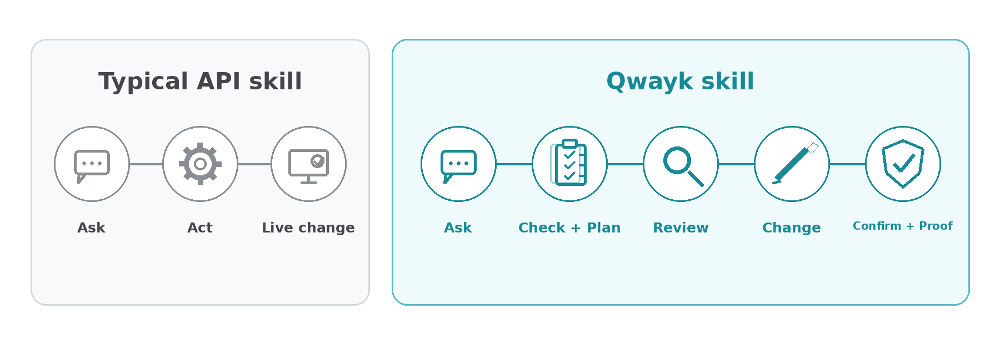

# How Qwayk skills keep agents safer

Qwayk skills are for people who want their AI agent to do real work in real products without feeling like they are taking a blind risk. Instead of letting the agent rush through a live change, Qwayk skills slow the risky moments down with clearer steps, more review, and a better record of what happened, so it is easier to catch the wrong action, the wrong setting, accidental spend, or a result you cannot explain later.

## How this differs from common skill types

  

A lot of agent API tools stop at one of these shapes:

- a short set of instructions
- a small tool that mostly passes API calls through
- a tool that mostly forwards requests without enough review built in

Those shapes can still be useful, but they often leave too much judgment to the agent in the moment. The agent has access, but not enough guidance, not enough slowdown before risky work, and not enough proof after the job is done.

Qwayk skills go one step further. They do not only tell the agent what to do. They also give the agent a safer work path and give the user a clearer way to review the result.

## How Qwayk skills help you stay in control

Most tools help the agent act. Qwayk skills are built to help you stay in control while the agent acts.

The routine is simple:

1. Start with the job the user wants done.
2. Point the agent to a clear action instead of making it guess.
3. Show the plan first when the job can change something important.
4. Ask for approval before a risky step.
5. Make the change only when the right checks are in place.
6. Check what happened after the job runs.
7. Save proof so the result is easier to review later.

That does not make the tool risk-free. It makes the risky path slower, clearer, and easier to review.

## What that means in real life

This is the difference the user feels:

- The agent is less likely to guess the wrong action.
- You are more likely to see the plan before a risky change.
- Important changes can leave a clearer trail behind them.
- Some tools can point to a clear reverse step for a narrow change.
- Some tools can save the exact setting, rule, text, file, or item they are about to change.
- Some tools can use the product's own restore, backup, or version history when that really exists.
- Some smaller changes have a clear way back.
- Some changes cannot be put back automatically, so the skill says that clearly before approval.
- Sensitive results do not always have to be dropped into the chat window.

That is why Qwayk skills are not just another set of API skills. They make real product work more reviewable, more understandable, and easier to trust.

## What happens before a change

Before an important change, a Qwayk skill should help the agent look at the account first and show you the plan.

When possible, the skill should save the exact setting, rule, text, file, or item it is about to change. That gives the agent something real to compare with after the work runs.

If the product has its own restore, backup, or version history, the skill should use that when it really exists. Some smaller changes also have a clear way back, like changing a setting back to the old value.

This is not a promise that every action can be undone. Some products do not give the skill enough information to safely put a change back later.

When the skill cannot save enough information to put a change back, it should say that clearly before you approve the work. For bigger risky actions, it should ask for clearer approval. It should not refuse normal approved work just because a perfect safety record is not possible.

## Real examples of the guardrails

These are real patterns from the wider Qwayk skills model:

- A spend-related change can ask for extra approval before money is affected.
- A skill can point to a clear reverse action when the product already supports one.
- A product with its own backup or restore action can keep that separate from ordinary changes.
- A tool can stop if the situation changed since the earlier plan.
- A sensitive result can be saved to a local file instead of being dropped into chat.

That matters because the safety does not live only in the instructions. Part of it is built into the tool itself.

## Browse public skills

If you want to see what is already public, open the full skill catalog.

> **[Open the full skill catalog ->](../skills/README.md)**
> Browse public skills across monitoring, analytics, ads, tracking, CRM, support, commerce, payments, websites, cloud, AI platforms, social, media, and public-data tools.

## For technical readers

If you want the deeper technical proof, these are the patterns to look for in Qwayk skills:

- clear command names instead of one do-anything command
- saved plans before higher-risk changes
- approval rules that match the kind of risk
- verification after the job runs
- exact recovery wording instead of a fake blanket undo story
- proof files that show what the tool planned and what it did
- safer handling for sensitive results

Those patterns matter because they reduce guessing and make reviews easier after the job runs.

## Limits and risk

Qwayk skills can reduce risk, but they do not remove it. They do not promise perfect safety, zero risk, or protection from every attack or human mistake.

If you use these tools on live accounts, live settings, or live data, you do so at your own risk. You are still responsible for reviewing the skill, deciding where it is safe to use it, checking the plan, and approving live changes.

The goal is simpler and more honest:

- clearer actions
- better review points
- more visible proof
- fewer hidden surprises

You should still inspect skills before broad use, keep keys local, use test accounts when that is practical, and approve live changes carefully.

## Where to inspect the details

- [Repo overview](../README.md)
- [Install guide](../INSTALL.md)
- [Security notes](../SECURITY.md)
- [Full skill catalog](../skills/README.md)

Each skill page links to its own safety model, command reference, coverage notes, and first-run help where those docs exist.
